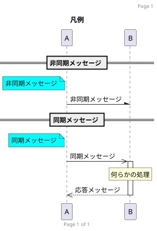
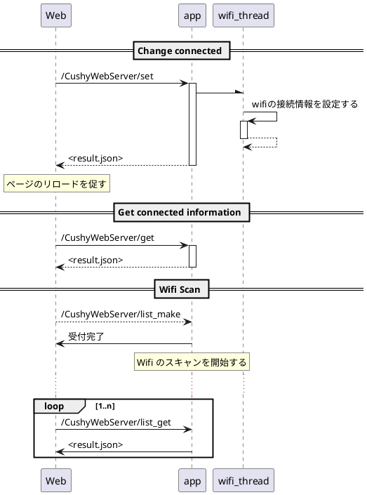

# Cushy Web Server - specification

```plantuml
@startuml
header Page %page%
footer Page %page% of %lastpage%
title 凡例

participant A
participant B

== 非同期メッセージ ==
note left of A #aqua
非同期メッセージ
end note
A -\ B: 非同期メッセージ


== 同期メッセージ ==

note left of A #aqua
同期メッセージ
end note
A ->> B ++: 同期メッセージ
rnote over B
 何らかの処理
endrnote
return 応答メッセージ

@enduml
```

## 通信内容

/CushyWebServer/set
/CushyWebServer/get
/CushyWebServer/list_get
/CushyWebServer/list_make

```plantuml
@startuml

== Change connected ==

Web -> app ++: /CushyWebServer/set
app -\ wifi_thread
wifi_thread -> wifi_thread ++: wifiの接続情報を設定する
return

return <result.json>
rnote over Web
 ページのリロードを促す
endrnote

== Get connected information ==

Web -> app ++: /CushyWebServer/get
return <result.json>

== Wifi Scan ==

Web --> app: /CushyWebServer/list_make
Web <- app: 受付完了
rnote over app
 Wifi のスキャンを開始する
endrnote
...

loop 1..n
Web -> app: /CushyWebServer/list_get
Web <- app: <result.json>
end

@enduml
```
